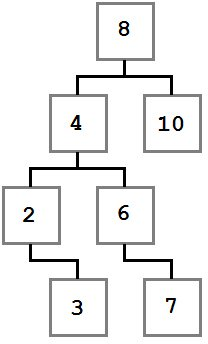
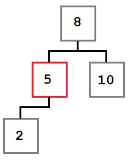
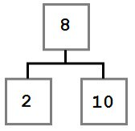
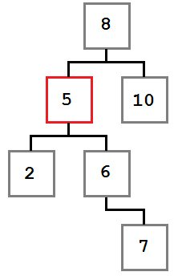
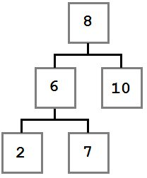
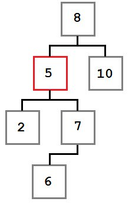
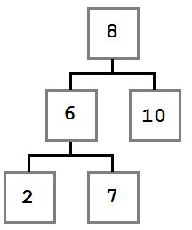
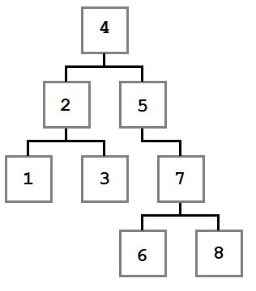

# Структуры данных:
## Связный список:
Основное назначение связного списка — предоставление механизма для хранения и доступа к произвольному количеству данных.
Как следует из названия, это достигается связыванием данных вместе в список. Преимущество списка по сравнению с массивом -
отсутсвие ограничения по длине.

В основе связного списка лежит понятие узла. Узел - это контейнер,который позволяет хранить данные и получать следующий
узел.
### Методы:
#### 1)add:
* **Поведение**: Добавляет элемент в конец списка.
* **Сложность**: O(1).

Добавление элемента в связный список производится в три этапа:
* Создать экземпляр класса `LinkedListNode`.
* Найти последний узел списка.
* Установить значение поля `next` последнего узла списка так, чтобы оно указывало на созданный узел.

#### 2)remove:
* **Поведение**: Удаляет первый элемент списка со значением, равным переданному. Возвращает true, если элемент был
удален и false в противном случае.
* **Сложность**: O(n).

Алгоритм удаления:
* Найти узел, который необходимо удалить.
* Изменить значение поля `next` предыдущего узла так, чтобы оно указывало на узел, следующий за удаляемым.

При удалении элемента необходимо учесть:
* Список может быть пустым, или значение, которое мы передаем в метод может не присутствовать в списке.
В этом случает список останется без изменений.
* Удаляемый узел может быть единственным в списке. В этом случае мы установим значения полей `head` и `tail` равными null.
* Удаляемый узел будет в начале списка. В этом случае мы записываем в `head` ссылку на следующий узел.
* Удаляемый узел будет в середине списка.
* Удаляемый узел будет в конце списка. В этом случае мы записываем в `tail` ссылку на предпоследний узел,
а в его поле `next` записываем null.

#### 3)contains:
* **Поведение**: Возвращает true или false в зависимости от того, присутствует ли искомый элемент в списке.
* **Сложность**: O(n).

Метод `contains` просматривает каждый элемент списка, от первого до последнего, и возвращает true как только найдет узел,
чье значение равно переданному параметру. Если такой узел не найден, и метод дошел до конца списка, то возвращается false.

#### 4)clear:
* **Поведение**: Удаляет все элементы из списка.
* **Сложность**: O(1).

Метод `clear` устанавливает значения полей `head` и `tail` равными null.

#### 5)copyTo:
* **Поведение**: Копирует содержимое списка в указанный массив, начиная с указанного индекса.
* **Сложность**: O(n).
Метод `copyTo` проходит по списку и копирует элементы в массив с помощью присваивания.

#### 6)count:
* **Поведение**: Возвращает количество элементов списка. Возвращает 0, если список пустой.
* **Сложность**: O(1).

## Двусвязный список:
Двусвязный списко - предоставляет доступ к обоим концам списка. Двусвязный список допускает только последовательный доступ
к элементам, но при этом дает возможность перемещаться в обе стороны. В этом списке проще производить удаление и перестановку 
элементов, так как легко доступны адреса тех элементов списка, указатели которых направлены на изменяемый элемент.
### Методы:
#### 1)addFirst:
* **Поведение**: Добавляет элемент в начало списка.
* **Сложность**: O(1).

Добавление элемента в двусвязный список производится в три этапа:
* Установить значение поля `next` в новом узле так, чтобы оно указывало на бывший первый узел.
* Установить значение поля `previous` в бывшем первом узле так, чтобы оно указывало на новый узел.
* Обновить поле `tail` при необходимости и инкрементировать поле `count`.

#### 2)addLast:
* **Поведение**: Добавляет элемент в конец списка.
* **Сложность**: O(1).

Добавление узла в конец списка легче, чем в начало. Мы просто создаем новый узел и обновляем поля `head` и `tail`,
а затем инкрементируем поле `count`.

#### 3)removeFirst:
* **Поведение**: Удаляет первый элемент списка. Если список пуст, не делает ничего. Возвращает true,
если элемент был удален и false в противном случае.
* **Сложность**: O(1).

Устанавливаем ссылку `head` на второй узел списка и обнуляем поле `previous` этого узла, удаляя таким образом все
ссылки на предыдущий первый узел. Если список был пуст или содержал только один элемент, то поля `head` и `tail`
становятся равными null.

#### 4)removeLast:
* **Поведение**: Удаляет последний элемент списка. Если список пуст, не делает ничего. 
Возвращает true, если элемент был удален и false в противном случае.
* **Сложность**: O(1).

Устанавливаем значение поля `tail` так, чтобы оно указывало на предпоследний элемент списка и, таким образом, удаляет
последний элемент. Если список был пустым, или содержал только один элемент, то поля `head` и `tail` становятся равны null.

#### 5)remove:
* **Поведение**: Удаляет первый элемент списка со значением, равным переданному. Возвращает true, если элемент был удален
и false в противном случае.
* **Сложность**: O(n).

Алгоритм удаления:
* Найти узел, который необходимо удалить.
* Изменить значение поля `next` и `previous` так, чтобы они указывали на узел, следующий за удаляемым и предыдущий соответсвенно.

#### 6)contains:
* **Поведение**: Возвращает true или false в зависимости от того, присутствует ли искомый элемент в списке.
* **Сложность**: O(n).

Метод `contains` просматривает каждый элемент списка, от первого до последнего, и возвращает true как только найдет узел,
чье значение равно переданному параметру. Если такой узел не найден, и метод дошел до конца списка, то возвращается false.

#### 7)clear:
* **Поведение**: Удаляет все элементы из списка.
* **Сложность**: O(1).

Метод `clear` устанавливает значения полей `head` и `tail` равными null.

#### 8)copyTo:
* **Поведение**: Копирует содержимое списка в указанный массив, начиная с указанного индекса.
* **Сложность**: O(n).
Метод `copyTo` проходит по списку и копирует элементы в массив с помощью присваивания.

#### 8)copyToReverse:
* **Поведение**: Копирует содержимое списка в указанный массив, начиная с указанного индекса в обратном порядке.
* **Сложность**: O(n).
Метод `copyToReverse` проходит по списку и копирует элементы в массив с помощью присваивания начиная с конца списка.

#### 10)count:
* **Поведение**: Возвращает количество элементов списка. Возвращает 0, если список пустой.
* **Сложность**: O(1).

## ArrayList
Это коллекция, использующая массив для хранения элементов. ArrayList может хранить произвольное число элементов.

###Расширение массива:
По мере добавления элементов внутренний массив может переполниться. В этом случае необходимо сделать следующее:

* Создать массив большего размера.
* Скопировать элементы в новый массив.
* Обновить ссылку на внутренний массив списка так, чтобы она указывала на новый

Подход увеличения размера масиисва(стандартный подход в Java - медленный рост): size = (size * 3) / 2 + 1;

### Методы:
#### 1)insert:
* **Поведение**: добавляет элемент по указанному индексу. Если индекс равен количеству элементов или больше него,
кидает исключение.
* **Сложность**: O(n).

Вставка по определенному индексу требует сдвига всех элементов, начиная с этого индекса, на одну позицию вправо.
Если внутренний массив заполнен, вставка потребует увеличения его размера.

#### 2)add:
* **Поведение**: добавляет элемент в конец списка.
* **Сложность**: O(1), если осталось более одного свободного места; O(n), если необходимо расширение массива.

#### 3)removeAt:
* **Поведение**: удаляет элемент, расположенный по заданному индексу.
* **Сложность**: O(n).

Удаление элемента по индексу — операция, обратная вставке. Указанный элемент удаляется, а остальные сдвигаются на одну
позиуию влево.

#### 4)remove:
* **Поведение**: удаляет первый элемент, значение которого равно предоставленному.
Возвращает true, если элемент был удален, или false в противном случае.
* **Сложность**: O(n).

#### 5)indexOf:
* **Поведение**: возвращает индекс первого элемента, значение которого равно предоставленному,
или -1, если такого значения нет.
* **Сложность**: O(n).

#### 5)getElement:
* **Поведение**: возвращает элемент, расположенный по заданному индексу.
* **Сложность**: O(1).

#### 6)contains:
* **Поведение**: возвращает true, если значение есть в списке, и false в противном случае.
* **Сложность**: O(n).

#### 7)clear:
* **Поведение**: удаляет все элементы из списка.
* **Сложность**: O(1).

#### 8)copyTo:
* **Поведение**: копирует все элементы из внутреннего массива в указанный, начиная с указанного индекса.
* **Сложность**: O(n).

#### 9)size:
* **Поведение**: возвращает текущее количество элементов в коллекции. Если список пуст, возвращает 0.
* **Сложность**: O(1).

#### 10)toArray:
* **Поведение**: возвращает массив, в котором хранятся элементы коллекции.
* **Сложность**: O(1).

## Stack(основанный на двусвязном списке)
Стек — это коллекция, элементы которой получают по принципу «последний вошел, первый вышел» 
(Last-In-First-Out или LIFO). Имеется доступ только к последнему элементу. Нет доступа к произвольному элементу
коллекции.

Классический пример использования стека — калькулятор в обратной польской, или постфиксной, записи. В ней оператор
записывается после своих операндов. То есть, мы пишем: <операнд> <операнд> <оператор>.

### Методы:
#### 1)push
* **Поведение**: добавляет элемент на вершину стека.
* **Сложность**: O(1).

#### 2)pop
* **Поведение**: удаляет элемент с вершины стека и возвращает его.
Если стек пустой, кидает IllegalStateException.
* **Сложность**: O(1).

#### 3)peek
* **Поведение**: возвращает верхний элемент стека. Если стек пустой, кидает IllegalStateException.
* **Сложность**: O(1).

#### 4)size
* **Поведение**: возвращает количество элементов в стеке.
* **Сложность**: O(1).

## Очередь(основанна на двусвязном списке)
Очередь — это коллекция, элементы которой получают по принципу «первый вошел, первый вышел» (First-In-First-Ou или
FIFO). Имеется доступ только к первому элементу. Нет доступа к произвольному элементу коллекции.

Очереди часто используются в программах для реализации буфера, в который можно положить элемент для последующей
обработки, сохраняя порядок поступления. Например, если база данных поддерживает только одно соединение, можно
использовать очередь потоков, которые будут, как ни странно, ждать своей очереди на доступ к БД.

### Методы:
#### 1)enqueue
* **Поведение**: добавляет элемент в очередь.
* **Сложность**: O(1).

#### 2)dequeue
* **Поведение**: удаляет первый помещенный элемент из очереди и возвращает его. Если очередь пустая,
 кидает IllegalStateException.
* **Сложность**: O(1).

#### 3)peek
* **Поведение**: возвращает первый элемент из очереди. Очередь остается без изменений. Если очередь пустая,
кидает IllegalStateException.
* **Сложность**: O(1).

#### 4)peek
* **Поведение**: возвращает первый элемент из очереди. Очередь остается без изменений. Если очередь пустая,
кидает IllegalStateException.
* **Сложность**: O(1).

#### 4)size
* **Поведение**: возвращает количество элементов в очереди или 0, если очередь пустая.
* **Сложность**: O(1).

## Двусторонняя очередь(основанна на двусвязном списке)
Двусторонняя очередь (Double-ended queue), или дек (Deque), расширяет поведение очереди. В дек можно добавлять
или удалять элементы как с начала, так и с конца очереди. Такое поведение полезно во многих задачах, например,
планирование выполнения потоков или реализация других структур данных.

### Методы:
#### 1)enqueueFirst
* **Поведение**: Добавляет элемент в начало очереди.
* **Сложность**: O(1).

#### 2)enqueueLast
* **Поведение**: Добавляет элемент в конец очереди.
* **Сложность**: O(1).

#### 3)dequeueFirst
* **Поведение**: удаляет элемент из начала очереди и возвращает его. Если очередь пустая, кидает IllegalStateException.
* **Сложность**: O(1).

#### 4)dequeueLast
* **Поведение**: удаляет элемент из конца очереди и возвращает его. Если очередь пустая, кидает IllegalStateException.
* **Сложность**: O(1).

#### 5)peekFirst
* **Поведение**: возвращает элемент из начала очереди. Если очередь пустая, кидает IllegalStateException.
* **Сложность**: O(1).

#### 6)peekLast
* **Поведение**: возвращает элемент из конца очереди. Если очередь пустая, кидает IllegalStateException.
* **Сложность**: O(1).

#### 4)size
* **Поведение**: возвращает количество элементов в очереди или 0, если очередь пустая.
* **Сложность**: O(1).

## Двусторонняя очередь(основана на массиве)
У реализации очереди с использованием массива есть свои преимущества. Она выглядит простой, но на самом деле есть
ряд нюансов, которые надо учесть. При создании очереди у нее внутри создается массив нулевой длины.

### Пример работы с очередью(h - head, t - tail):
```
deq.enqueueFirst(1): [1 - - -] 
                      ht
```
```
deq.enqueueLast(2): [1 2 - -] 
                     h t
```
```
deq.EnqueueFirst(0): [1 2 - 0]
                        t   h 
```
```
deq.EnqueueLast(3);: [1 2 3 0]
                          t h
```
Массив заполнен, поэтому при добавлении элемента произойдет следующее:
1. Алгорим роста определит размер нового массива.
2. Элементы скопируются в новый массив с «головы» до «хвоста».
3. Добавится новый элемент.  
```
deq.EnqueueLast(4): [0 1 2 3 4 - - -]
                     h       t
```

Теперь посмотрим, что происходит при удалении элемента:
```
deq.DequeueFirst(): [- 1 2 3 4 - - -]
                       h     t
```
```
deq.DequeueLast(): [- 1 2 3 - - - -]
                      h   t
```                      
Ключевой момент: вне зависимости от вместимости или заполненности внутреннего массива, логически,
содержимое очереди — элементы от «головы» до «хвоста» с учетом «закольцованности». Такое поведение также называется
«кольцевым буфером». 

### Методы:

#### 1)enqueueFirst:
* **Поведение**: Добавляет элемент в начало очереди. 
* **Сложность**: O(1) в большинстве случаев; O(n), когда нужно расширение массива.

#### 2)enqueueLast:
* **Поведение**: Добавляет элемент в конец очереди. 
* **Сложность**: O(1) в большинстве случаев; O(n), когда нужно расширение массива.

#### 3)dequeueFirst:
* **Поведение**: Удаляет элемент с начала очереди и возвращает его. Если очередь пустая, кидает IllegalStateException.
* **Сложность**: O(1).

#### 4)dequeueLast:
* **Поведение**: Удаляет элемент с конца очереди и возвращает его. Если очередь пустая, кидает IllegalStateException.
* **Сложность**: O(1).

#### 5)peekFirst:
* **Поведение**: Возвращает элемент с начала очереди. Если очередь пустая, кидает IllegalStateException.
* **Сложность**: O(1).

#### 6)peekLast:
* **Поведение**: Возвращает элемент с конца очереди. Если очередь пустая, кидает IllegalStateException.
* **Сложность**: O(1).

#### 7)size:
* **Поведение**: Возвращает количесвто элементов в очереди
* **Сложность**: O(1).

## Множество
Множество — это коллекция, которая реализует основные математические операции над множествами:
пересечения (intersection), объединение (union), разность (difference) и симметрическая разность (symmetric difference).

### Методы:

#### 1)add:
* **Поведение**: Добавляет элементы в множество. Если элемент уже присутствует в множестве,
бросается исключение IllegalArgumentException.
* **Сложность**: O(1).

Дублируемые элементы не добавляются во множество.

#### 2)addRange:
* **Поведение**: Добавляет несколько элементов в множество. Если какой-либо из добавляемых элементов присутствует
в множестве, или в добавляемых элементах есть дублирующиеся, выбрасывается исключение IllegalArgumentException.
* **Сложность**: O(m·n), где m — количество вставляемых элементов и n — количество элементов множества.

#### 3)remove:
* **Поведение**: Удаляет указанный элемент из множества и возвращает true. В случае, если элемента нет,
возвращает false.
* **Сложность**: O(n).

#### 4)contains:
* **Поведение**: Возвращает true, если множество содержит указанный элемент. В противном случае возвращает false.
* **Сложность**: O(n).

#### 5)size:
* **Поведение**: Возвращает количество элементов множества или 0, если множество пусто.
* **Сложность**: O(1).

#### 6)union:
* **Поведение**: Возвращает множество, полученное операцией объединения его с указанным.
* **Сложность**: O(m·n), где m и n — количество элементов переданного и текущего множеств соответственно.

Объединение множеств — это множество, которое содержит элементы, пртсутствующие хотя бы в одном из двух.
```
[1, 2, 3, 4] union [3, 4, 5, 6] = [1, 2, 3, 4, 5, 6]
```

#### 7)intersection:
* **Поведение**: Возвращает множество, полученное операцией пересечения его с указанным.
* **Сложность**: O(m·n), где m и n — количество элементов переданного и текущего множеств соответственно.

Пересечение множеств содержит только те элементы, которые есть в обоих множествах.
```
[1, 2, 3, 4] intersect [3, 4, 5, 6] = [3, 4]
```

#### 8)difference:
* **Поведение**: Возвращает множество, являющееся разностью текущего с указанным.
* **Сложность**: O(m·n), где m и n — количество элементов переданного и текущего множеств соответственно.

Разность множеств — это все элементы, которые содержатся в одном множестве (том, у которого вызывается метод),
но не содержатся в другом (том, которое передается аргументом).
```
[1, 2, 3, 4] difference [3, 4, 5, 6] = [1, 2]
```

#### 9)symmetricDifference:
* **Поведение**: Возвращает множество, являющееся симметрической разностью текущего с указанным.
* **Сложность**: O(m·n), где m и n — количество элементов переданного и текущего множеств соответственно.

Симметрическая разность — это все элементы, которые содержатся только в одном из рассматриваемых множеств. 
```
[1, 2, 3, 4] symmetric difference [3, 4, 5, 6] = [1, 2, 5, 6]
```

#### 10)isSubset:
* **Поведение**: Возвращает true, если текущее множество является подмножеством указанного множества.
* **Сложность**: O(m·n), где m и n — количество элементов переданного и текущего множеств соответственно.

Симметрическая разность — это все элементы, которые содержатся только в одном из рассматриваемых множеств. 
```
[1, 2, 3] is subset [0, 1, 2, 3, 4, 5] = true
```

## Двоичное дерево поиска
Дерево — это структура, в которой у каждого узла может быть ноль или более подузлов — «детей». Двоичное дерево строится
по определенным правилам:
* У каждого узла не более двух детей.
* Любое значение меньше значения узла становится левым ребенком или ребенком левого ребенка.
* Любое значение больше или равное значению узла становится правым ребенком или ребенком правого ребенка.

Пример двоичного дерева поиска:



Каждое значение слева от корня (8) меньше восьми, каждое значение справа — больше либо равно корню.
Это правило применимо к любому узлу дерева. Учитывая это, можно представить, как было построено такое дерево. Мы не
знаем точно, в каком порядке добавлялись остальные значения, но можем представить один из возможных путей:
```
BinaryTree tree = new BinaryTree();
tree.Add(8);
tree.Add(4);
tree.Add(2);
tree.Add(3);
tree.Add(10);
tree.Add(6);
tree.Add(7);
```

Рассмотрим подробнее первые шаги. В первую очередь добавляется 8. Это значение становится корнем дерева.
Затем мы добавляем 4. Поскольку 4 меньше 8, мы кладем ее в левого ребенка, согласно правилу 2. Поскольку у узла с
восьмеркой нет детей слева, 4 становится единственным левым ребенком. После этого мы добавляем 2. 2 меньше 8, поэтому
идем налево. Так как слева уже есть значение, сравниваем его со вставляемым. 2 меньше 4, а у четверки нет детей слева,
поэтому 2 становится левым ребенком 4. Затем мы добавляем тройку. Она идет левее 8 и 4. Но так как 3 больше, чем 2,
она становится правым ребенком 2, согласно третьему правилу. Последовательное сравнение вставляемого значения с
потенциальным родителем продолжается до тех пор, пока не будет найдено место для вставки, и повторяется для каждого
вставляемого значения до тех пор, пока не будет построено все дерево целиком.

###Методы:

#### 1)add:
* **Поведение**: Добавляет элемент в дерево на корректную позицию.
* **Сложность**: O(log n) в среднем; O(n) в худшем случае.

Добавление узла не представляет особой сложности. Оно становится еще проще, если решать эту задачу рекурсивно.
Есть всего два случая, которые надо учесть:
* Дерево пустое.
* Дерево не пустое.

Если дерево пустое, мы просто создаем новый узел и добавляем его в дерево. Во втором случае мы сравниваем переданное
значение со значением в узле, начиная от корня. Если добавляемое значение меньше значения рассматриваемого узла,
повторяем ту же процедуру для левого поддерева. В противном случае — для правого.

#### 2)remove:
* **Поведение**: Удаляет первый узел с заданным значением.
* **Сложность**: O(log n) в среднем; O(n) в худшем случае.

Алгоритм удаления элемента выглядит так:
 * Найти узел, который надо удалить.
 * Удалить его.
 
После того, как мы нашли узел, который необходимо удалить, у нас возможны три случая:

Случай 1: у удаляемого узла нет правого ребенка:



В этом случае мы просто перемещаем левого ребенка (при его наличии) на место удаляемого узла. В результате дерево будет
выглядеть так:



Случай 2: у удаляемого узла есть правый ребенок, у которого, в свою очередь нет левого ребенка:



В этом случае нам надо переместить правого ребенка (6) удаляемого узла (5) на его место. После удаления дерево
будет выглядеть так:



Случай 3: у удаляемого узла есть первый ребенок, у которого есть левый ребенок:



В этом случае место удаляемого узла занимает крайний левый ребенок правого ребенка удаляемого узла.

Давайте посмотрим, почему это так. Мы знаем о поддереве, начинающимся с удаляемого узла следующее:

 * Все значения справа от него больше или равны значению самого узла.
 * Наименьшее значение правого поддерева — крайнее левое.

Мы дожны поместить на место удаляемого узла со значением, меньшим или равным любому узлу справа от него.
Для этого нам необходимо найти наименьшее значение в правом поддереве. Поэтому мы берем крайний левый узел правого
поддерева.

После удаления узла дерево будет выглядеть так:



#### 3)contains:
* **Поведение**: Возвращает true если значение содержится в дереве. В противном случает возвращает false.
* **Сложность**: O(log n) в среднем; O(n) в худшем случае.

#### 4)size:
* **Поведение**: Возвращает количество узлов дерева или 0, если дерево пустое.
* **Сложность**: O(1).

#### 5)clear:
* **Поведение**: Удаляет все узлы дерева.
* **Сложность**: O(1).

Обходы дерева — это семейство алгоритмов, которые позволяют обработать каждый узел в определенном порядке.
Для всех алгоритмов обхода ниже в качестве примера будет использоваться следующее дерево:



#### 6)preorder:
* **Поведение**: Обходит дерево в префиксном порядке, выполняя указанное действие над каждым узлом.
* **Сложность**: O(n)
* **Порядок обхода**: 4, 2, 1, 3, 5, 7, 6, 8

При префиксном обходе алгоритм получает значение текущего узла перед тем, как перейти сначала в левое поддерево,
а затем в правое. Начиная от корня, сначала мы получим значение 4. Затем таким же образом обходятся левый ребенок и его
дети, затем правый ребенок и все его дети.

Префиксный обход обычно применяется для копирования дерева с сохранением его структуры.

#### 7)postorder:
* **Поведение**: Обходит дерево в постфиксном порядке, выполняя указанное действие над каждым узлом.
* **Сложность**: O(n)
* **Порядок обхода**: 1, 3, 2, 6, 8, 7, 5, 4

При постфиксном обходе мы посещаем левое поддерево, правое поддерево, а потом, после обхода всех детей, переходим к самому узлу.

Постфиксный обход часто используется для полного удаления дерева, так как в некоторых языках программирования
необходимо убирать из памяти все узлы явно, или для удаления поддерева. Поскольку корень в данном случае
обрабатывается последним, мы, таким образом, уменьшаем работу, необходимую для удаления узлов.

#### 7)inorder :
* **Поведение**: Обходит дерево в инфиксном порядке, выполняя указанное действие над каждым узлом.
* **Сложность**: O(n)
* **Порядок обхода**: 1, 2, 3, 4, 5, 6, 7, 8

Инфиксный обход используется тогда, когда нам надо обойти дерево в порядке, соответствующем значениям узлов.
В примере выше в дереве находятся числовые значения, поэтому мы обходим их от самого маленького до самого большого.
То есть от левых поддеревьев к правым через корень.